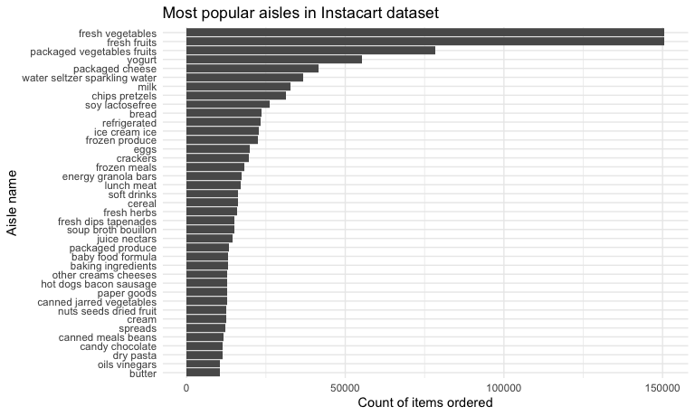

HW 3: Visualization and EDA
================
Emma Gorin
October 2020

``` r
library(tidyverse)

knitr::opts_chunk$set(
  fig.width = 8,
  fig.asp = .6,
  out.width = "90%"
)

theme_set(theme_minimal() + theme(legend.position = "bottom"))

options(
  ggplot2.continuous.colour = "viridis",
  ggplot2.continuous.fill = "viridis"
)

scale_colour_discrete = scale_color_viridis_d
scale_fill_discrete = scale_fill_viridis_d
```

## Problem 1

This problem uses the Instacart data. DO NOT include this dataset in
your local data directory; instead, load the data from the
p8105.datasets using:

``` r
library(p8105.datasets)
data("instacart")
```

The goal is to do some exploration of this dataset. To that end, write a
short description of the dataset, noting the size and structure of the
data, describing some key variables, and giving illustrative examples of
observations.

**The instacart dataset includes data about grocery orders placed
through Instacart. The dataset includes 15 columns and 1384617
observations, each representing a single item included in an order.
Variables include both details about the order (such as order id number,
days since prior order, hour of the day at which the order was placed)
and details about the product (such as product name, the aisle and
department in which the product can be found, and whether the product
was re-ordered.) For instance, we can see that the order with order id
\#98 included Organic Stringles Mozzarella String Cheese which can be
found in the packaged cheese aisle and which was reordered.**

Then, do or answer the following (commenting on the results of each):

  - How many aisles are there, and which aisles are the most items
    ordered from?

<!-- end list -->

``` r
most_pop_aisles.df = instacart %>%
  group_by(aisle) %>% 
  summarize(n_obs = n()) %>% 
  arrange(desc(n_obs))
```

    ## `summarise()` ungrouping output (override with `.groups` argument)

**There are 134 aisles. Most items are ordered from the fresh vegetables
aisle with 150609 items ordered, closely followed by the fresh fruits
aisle with 150473 items ordered. Distant 3rd, 4th and 5th places are
held by packaged vegetables fruits, yogurt, and packaged cheese.**

  - Make a plot that shows the number of items ordered in each aisle,
    limiting this to aisles with more than 10000 items ordered. Arrange
    aisles sensibly, and organize your plot so others can read it.

<!-- end list -->

``` r
instacart %>% 
  ungroup() %>% 
  mutate(aisle = factor(aisle)) %>% 
  group_by(aisle) %>% 
  mutate(count_aisle = n()) %>% 
  filter(count_aisle > 10000) %>% 
  select(aisle, count_aisle, everything()) %>% 
  ggplot(aes(x = fct_rev(fct_infreq(aisle)))) +
  geom_bar() +
  coord_flip() +
  labs(
    title = "Most popular aisles in Instacart dataset",
    y = "Count of items ordered",
    x = "Aisle name"
  )
```



  - Make a table showing the three most popular items in each of the
    aisles “baking ingredients”, “dog food care”, and “packaged
    vegetables fruits”. Include the number of times each item is ordered
    in your table.

  - Make a table showing the mean hour of the day at which Pink Lady
    Apples and Coffee Ice Cream are ordered on each day of the week;
    format this table for human readers (i.e. produce a 2 x 7 table).

## Problem 2

Accelerometers have become an appealing alternative to self-report
techniques for studying physical activity in observational studies and
clinical trials, largely because of their relative objectivity. During
observation periods, the devices measure “activity counts” in a short
period; one-minute intervals are common. Because accelerometers can be
worn comfortably and unobtrusively, they produce around-the-clock
observations.

This problem uses five weeks of accelerometer data collected on a 63
year-old male with BMI 25, who was admitted to the Advanced Cardiac Care
Center of Columbia University Medical Center and diagnosed with
congestive heart failure (CHF). The data can be downloaded here. In this
spreadsheet, variables activity.\* are the activity counts for each
minute of a 24-hour day starting at midnight.

  - Load, tidy, and otherwise wrangle the data. Your final dataset
    should include all originally observed variables and values; have
    useful variable names; include a weekday vs weekend variable; and
    encode data with reasonable variable classes. Describe the resulting
    dataset (e.g. what variables exist, how many observations, etc).
  - Traditional analyses of accelerometer data focus on the total
    activity over the day. Using your tidied dataset, aggregate accross
    minutes to create a total activity variable for each day, and create
    a table showing these totals. Are any trends apparent?
  - Accelerometer data allows the inspection activity over the course of
    the day. Make a single-panel plot that shows the 24-hour activity
    time courses for each day and use color to indicate day of the week.
    Describe in words any patterns or conclusions you can make based on
    this graph.

## Problem 3

This problem uses the NY NOAA data. DO NOT include this dataset in your
local data directory; instead, load the data from the p8105.datasets
package using:

``` r
library(p8105.datasets)
data("ny_noaa")
```

The goal is to do some exploration of this dataset. To that end, write a
short description of the dataset, noting the size and structure of the
data, describing some key variables, and indicating the extent to which
missing data is an issue. Then, do or answer the following (commenting
on the results of each):

  - Do some data cleaning. Create separate variables for year, month,
    and day. Ensure observations for temperature, precipitation, and
    snowfall are given in reasonable units. For snowfall, what are the
    most commonly observed values? Why?
  - Make a two-panel plot showing the average max temperature in January
    and in July in each station across years. Is there any observable /
    interpretable structure? Any outliers?
  - Make a two-panel plot showing (i) tmax vs tmin for the full dataset
    (note that a scatterplot may not be the best option); and (ii) make
    a plot showing the distribution of snowfall values greater than 0
    and less than 100 separately by year.
